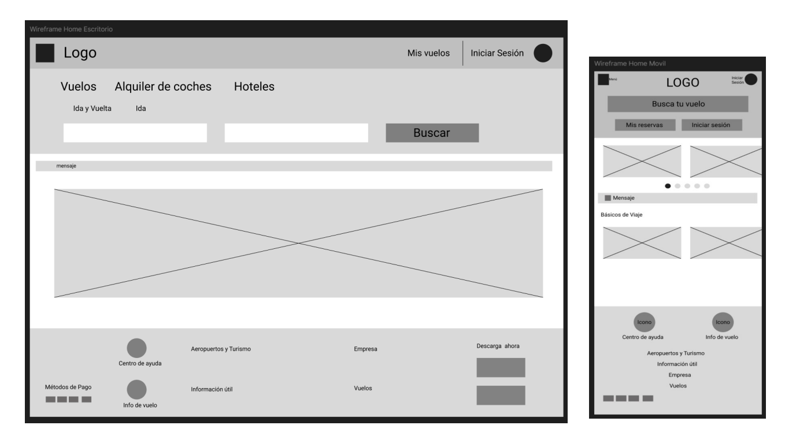
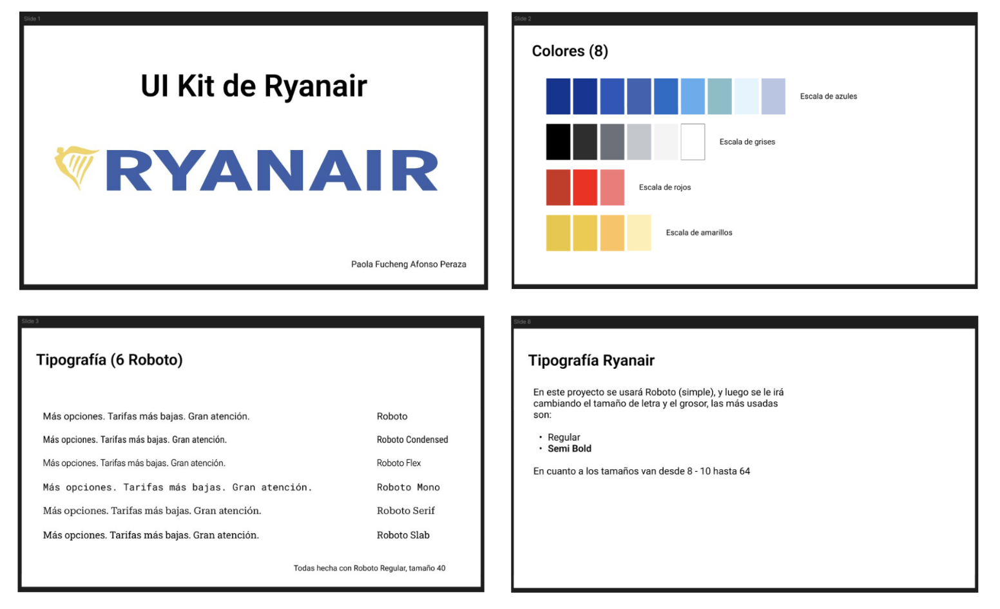
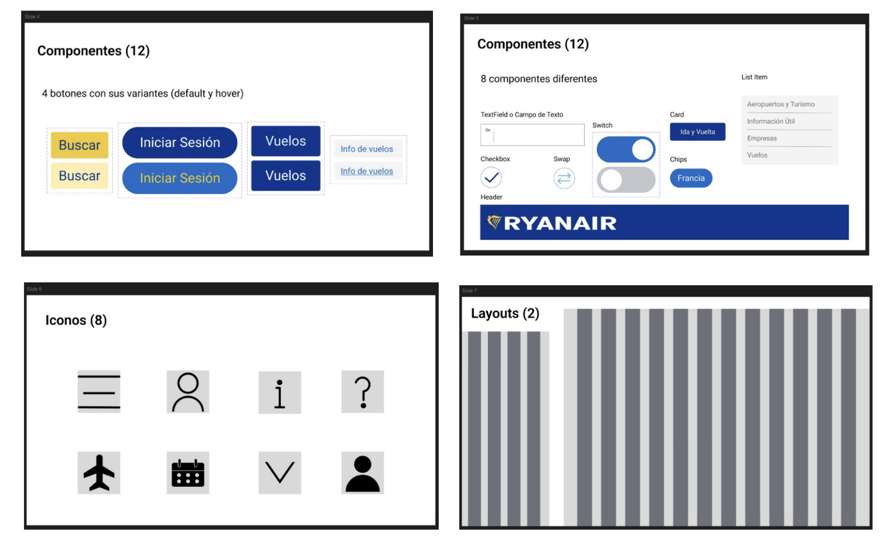
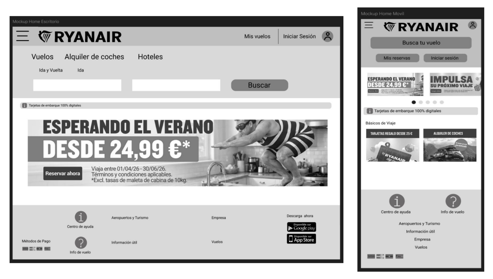
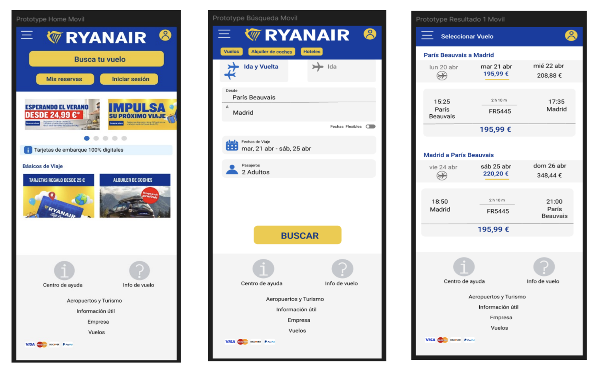

# Prácticas de Diseño de Interfaces Web

## Midterm

En esta práctica **he analizado el flujo de búsqueda y reserva en la plataforma de Ryanair** (versión web y móvil), lo cual evidencia un diseño guiado por un equilibrio entre la usabilidad funcional y la consecución de objetivos de negocio.

En términos de visibilidad del estado del sistema y prevención de errores, la interfaz cumple con los principios fundamentales de UX: destaca con claridad los campos activos, emplea patrones visuales familiares (como menús de hamburguesa, calendarios condicionales e iconos universales de incremento/decremento), y utiliza eficazmente las jerarquías tipográficas y el contraste de color para facilitar el flujo principal de búsqueda.

Sin embargo, el proceso de búsqueda se ve recurre a patrones persuasivos (dark patterns) orientados a la maximización de ingresos. En la selección de tarifas, equipaje y servicios adicionales se observa una manipulación deliberada del contraste visual: los botones que conllevan un coste extra utilizan colores llamativos, llamadas a la acción (CTA) destacadas y formatos destacados (como etiquetas de "Recomendado"), mientras que las opciones gratuitas o básicas se relegan a tonos grises o enlaces secundarios. Esto genera fricción, sobrecarga cognitiva y posibles confusiones intencionadas en el usuario.

En conclusión, Ryanair ofrece una arquitectura de información clara e intuitiva para los pasos esenciales de navegación, pero sacrifica parte de la transparencia y de la experiencia de usuario general al priorizar técnicas de diseño orientadas a la venta cruzada. Para mejorar la usabilidad global, la plataforma debería simplificar la toma de decisiones, reducir las distracciones durante la selección de vuelo y ofrecer opciones neutras y equitativas durante todo el proceso de compra.

- [Enlace de la práctica completa del midterm](https://docs.google.com/document/d/1TM76IbvDxl1bpl7AYDTxK7hp-tghzEB0PRmXSXytjZc/edit?usp=sharing)

## Endterm

En esta otra práctica, **he hecho Wireframes, un UI Kit, Mockups, Prototipos y Test de Tareas sobre el ejercicio anterior, la página de Ryanair**.

### Wireframing Ryanair

En este ejercicio he creado los **wireframes de la versión escritorio como de la versión móvil con el software Figma**. (No han sido de alta fidelidad, porque sentía que repetía mucho, y era copiar y pegar, y aunque queda más claro, a mí me parecía más confuso al mezclar iconos ya hechos y los míos creados desde cero. Ya en los mockups sí hay iconos (míos), y está todo mejor estructurado y se ve visualmente mejor). Veremos a continuación como en la versión móvil la página web es más sencilla y centrada a la búsqueda de vuelos. Lo único que distraen son los anuncios. Se mostrarán las capturas de pantalla de los diseño de los Wireframe respectivamente como se nombra, de igual manera, dentro de la imagen también se indica a qué corresponde.
- Wireframe Home Escritorio - Móvil
- Wireframe Búsqueda Escritorio - Móvil
- Wireframe Resultado 1 – Ida y Vuelta , Fecha normal Escritorio – Móvil
- Wireframe Resultado 2 – Ida y Vuelta , Fecha Flexible – Escritorio – Móvil
- Wireframe Resultado 3 – Ida , Fecha Flexible – Escritorio - Móvil

En este caso, solo he cambiado los mensajes de texto, para que sean más directos. Los iconos y botones están bien posicionados y con el mismo estilo, he hecho el header y en el footer. En mi opinión, he sido bastante fiel a la página original de Ryanair, ya que visualmente está muy bien y previene de errores en general y en los despegables, es fácil de hacer la búsqueda. El problema, como vimos en el midterm es que después de buscar el vuelo, hay problemas a propósito con los precios. Pero en esta práctica no se llega hasta tan lejos, por lo que es muy parecido mi diseño con el de Ryanair. He cambiado algunos mensajes o textos mayormente y he intentado hacerla más minimalista. De igual manera, se puede ir ahora a la página de Ryanair, y desde que se pidió hacer la práctica hasta ahora, han actualizado bastante cosas, mejorando así su página. También he intentado simplificar mucho más el diseño, para que no sea muy agobiante, sea sencillo y familiar.

### UI Kit Ryanair

**En este ejercicio he creado con Figma de un UI kit basado en Material Design.**

El UI Kit ha de incluir:
- Al menos 8 colores (incluyendo la escala de grises)
- Al menos 6 estilos tipográficos de la familia Roboto
- Al menos 12 componentes creados por ti mismo con el estilo de Material.
 - Mínimo 4 formatos de botón con sus variaciones de estado.
 - Mínimo 8 componentes diferentes a un botón (header, cards, chips, checkboxes, campos de texto, listas, etc)
- Al menos 8 iconos creados por ti mismo con el estilo de Material. Si se incluyen más de 8 iconos, estos iconos extra podrán ser descargados del Material icons.
 - Todos los iconos se han de realizar mediante el uso de operaciones boleanas.
- 2 Layouts:
 - Phone (extra-small) y Desktop (Large).

Adjunto la captura de pantalla de mi UI Kit, lo hice de manera sencilla, y todos los componentes / botones no se ven completamente reflejados en el Mockup ni en el Prototype, ya que sólo se interectúa con una parte del diseño o ciertos botones. Pero de igual manera, para este apartado, hice todas las creaciones / requisitos.

### Mockups Ryanair

En este ejercicio he creado los mockups con Figma. A partir del UI kit realizado en el ejercicio anterior. De igual manera que los Wireframes, veremos el diseño de sus respectivos Mockups.

### Prototipos

En este ejercicio he realizado un prototipo con Figma.
Para realizarlo he utilizado los mockups de la versión Móvil diseñados en el ejercicio anterior, y lo he mejorado, añadiendo color.

Adjunto las imágenes del prototipado, pero es necesario navegarlo.

### Test de Tareas

La web de Ryanair es muy funcional, pero está llena de "puntos de fricción" (pasos extra, ventas dirigidas, etc.) que pueden confundir al usuario. Veremos 8 propuestas de tareas claves, diseñadas para la gestión de venta de los vuelos, concretamente después de la búsqueda, ya que como comentamos anteriormente, es al encontrar el vuelo y seguir comprando el pasaje, que hay errores.

**1. Búsqueda de vuelo básico**
 - **Tarea:** Buscar un vuelo de ida y vuelta para dos adultos de Madrid a París Beauvais, para abril.
 - **Éxito:** Llegar a la pantalla de selección de horarios con los resultados correctos.
**2. Selección de tarifa y "extras"**
 - **Tarea:** Seleccionar el vuelo más barato y avanza hasta el formulario de datos personales sin añadir precios extras como: maletas facturadas o seguros
 - **Éxito:** No haber añadido ningún servicio de pago por error en el proceso.

**3. Elección de asientos**
 - **Tarea:** Eligir dos asientos específicos en la parte delantera del avión.
 - **Éxito:** Visualizar los asientos seleccionados en el resumen del precio antes de pagar.
**4. Registro y datos del pasajero**
 - **Tarea:** Rellenar los datos de los pasajeros. Comprobar si el sistema se puede seguir como invitado o es obligatorio crear una cuenta "myRyanair".
 - **Éxito:** Completar el formulario de contacto y llegar a la pasarela de pago. De manera sencilla y bien explicada.
**5. Añadir equipaje especial**
 - **Tarea:** Llevar una bicicleta o equipo deportivo. Encontrar dónde añadir este bulto especial.
 - **Éxito:** Localizar la opción y ver el coste adicional reflejado en el carrito.
**6. Alquiler de coche o Hotel**
 - **Tarea:** Durante el proceso de compra, añadir un coche de alquiler para los días del viaje.
 - **Éxito:** Integrar el servicio externo en la reserva actual sin perder los datos del vuelo.
**7. Gestión de una reserva existente**
 - **Tarea:** Acceder a una reserva ya realizada (usar datos ficticios) y cambia la fecha del vuelo de vuelta.
 - **Éxito:** Encontrar el botón de "Cambiar vuelo" y ver el recargo por el cambio.
**8. Proceso de Check-in online**
 - **Tarea:** Realizar el check-in para obtener tus tarjetas de embarque en formato PDF o móvil.
 - **Éxito:** Llegar a la pantalla de descarga de la tarjeta de embarque (o confirmación de la misma).

Vemos entonces como el Éxito significa terminar la tarea, mientras que la interfaz de
Ryanair no “engañe” al usuario para comprar algo que no quería.

### Bibliografía
- [Enlace al UI Kit de Ryanair](https://www.figma.com/design/lYdo6FQiVvg8vD2cy7yGa4/UI-Kit-Design-Ryanair---Paola-Afonso?t=R2HZVIfFD7uMqrqm-1)

- [Enlace al Diseño Escritorio de Ryanair](https://www.figma.com/design/iX7i6jN4FHUJlj1vpxY98p/Escritorio-Dise%C3%B1o-Ryanair---Paola-Afonso?t=R2HZVIfFD7uMqrqm-1)

- [Enlace al Diseño Móvil de Ryanair](https://www.figma.com/design/wA4d9CkxJqTHwxZgggBg97/M%C3%B3vil-Dise%C3%B1o-Ryanair---Paola-Afonso?node-id=0-1&t=horYeqQoIDgkgY5e-1)

- [Enlace al Prototipo en Móvil de Ryanair](https://www.figma.com/proto/iX7i6jN4FHUJlj1vpxY98p/Escritorio-Dise%C3%B1o-Ryanair---Paola-Afonso?t=R2HZVIfFD7uMqrqm-1)